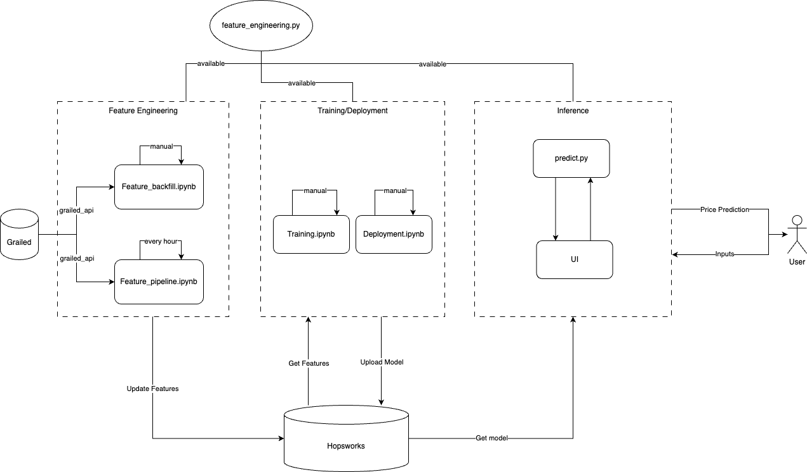
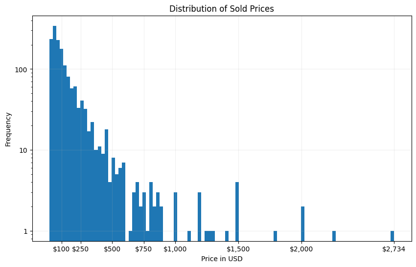

# Grailed Fashion Price Predictor

ID2223 final project - a Machine Learning (ML) pipeline for predicting the price of a fashion items listed on the online marketplace Grailed.

Created by Samuel Horacek (horacek@kth.se) and Eugene Park (epark@kth.se).

## How to run

1. Install dependencies, e.g. using `pip install -r requirements.txt`.
2. Fill the `.env` file with required secrets, defined in the `.env.example` file.

## Introduction and problem overview

[Grailed](https://www.grailed.com/) is a platform for buying and selling used fashion items. These fashion items can be designer garments, rare and archive pieces, or streetwear. What is often common for these items is that they are possibly not so easily found in stores, and thus the price is not so easily determined, since it can range from a few dollars to a few thousand.

Currently, there are million of live listings on the platform, and the number is growing. Every time a user wants to create a new listing, they have to fill out the relevant information about the item. This includes the brand, the size, the condition, color and others. Finally, a user has to set a price for the item. This can be tricky, and Grailed only provides a suggested price range, which can in some cases be quite inaccurate. This "Price range is calculated based on what most similar items recently sold for over the past few months (excluding shipping).". We think we can do better.

Our goal is to train a predictive model that can help users price their items accordingly. Using both historical data and the relevant information of the current listing, we want to predict the price of the item. For the suggestions to be as accurate as possible, we make use of information about previously sold items on Grailed.

### Data

There are a few approaches to getting this data. Since Grailed doesn't have an open API, we had to find another way to get the data. A common approach is to scrape the website, but this would require us to create such a tool from scratch.

Instead, we have used the [grailed_api](https://github.com/pznamir00/Grailed-API) Python library, which is a convenient wrapper for fetching data from Grailed. To do so, it creates and then sends requests to the Grailed's Algolia instance.

To train our model, we need to get the previously sold items. Since the Algolia instance/Grailed API allows only to query for a maximum of 1000 items, we consider the initial 1000 items as our original dataset (used in the backfill pipeline, see below). The dataset is being added to by an online pipeline.

### Feature engineering

To train our model, we need to abstract the data into features. We have created a feature engineering pipeline that takes the raw data and transforms it into a suitable format.

When selecting features, we were guided by our personal experience with the platform and by a [project](https://github.com/kirill-rubashevskiy/graildient-descent) we came across with a similar focus.

We set on the following features, already present in the dataset:

- `category_path`: The category path of the item, e.g. `accessories.hats`.
- `color`: The color of the item, e.g. `Black`.
- `condition`: The condition of the item, e.g. `is_new`.
- `designer_names`: The brands/designers of the item, e.g. `Gucci`.
- `followerno`: The number of followers of the seller, e.g. `100`.
- `hashtags`: The hashtags of the item, e.g. `#gucci`.
- `sold_price`: The price of the item (in USD) and the target variable, e.g. `100`.
- `title`: The title of the item, e.g. `Gucci hat`.

There are other features we could have considered. We wanted to, but had issues with (`size` and `userScore`).
Finally, we consider features that help identify and sort the items - `id` and `sold_at`, but we did not use them to train our model.

Since a lot of these features are categorical, we had to come up with a way of representing them in a format understandable by our predictive model - as numerical values:

- `category_path`, `color` were represented using label encoding.
- `condition` was represented using one-hot encoding.
- `designer_names`, `description`, `title`, `hashtags` were represented using embeddings (using the [fastembed](https://github.com/qdrant/fastembed) library).

We have found the `designer_names` and `title` to have the largest importance.

## Architecture

Our project adheres to the recommended architecture and concepts covered in the lectures. As outlined above, we retrieve data from the Grailed website using the `grailed_api` Python module. The feature pipeline runs hourly, orchestrated by `GitHub Actions`, while our feature_backfill script can be triggered manually to populate the feature store.

For the feature store, we chose `Hopsworks`, which serves as both a repository for features and a platform for hosting machine learning models. Our training and deployment scripts utilize the features stored in Hopsworks for model training and subsequently upload the trained models back to the platform. This approach allows us to reuse feature engineering logic and model transformations consistently across different scripts.

The user interface for inference is hosted on `Hugging Face Spaces`, leveraging `Gradio`. Gradio enables us to implement both the prediction logic and UI using a single language—Python. The UI downloads the trained model and applies the same feature transformation scripts stored in Hopsworks. Upon receiving a user request, it generates a prediction and returns the estimated price to the user.

## Predicting prices

As our predictive model, we have chosen a `CatBoostRegressor` from the [CatBoost](https://catboost.ai/) library. It was chosen as it works well with categorical features, it is easy to see the influence of each feature on the prediction and its hyperparameters are easy to tune.

We train the model on the training set, and then evaluate it on the test set (80-20 split). To prevent overfitting, we have used early stopping.

When tuning the model, we have looked into adjusting the number of trees (`iterations`), learning rate (`learning_rate`), depth of the trees (`depth`) and the loss function (`loss_function`).
The first three are optimally chosen by the library, but we have also tried to adjust them to see if we can improve the model, without much success. Finally, we have used the `LogCosh` loss function, which helped us not to overshoot our predictions as much, in comparison to say `RMSE`.

Finally, we have also looked at other models, such as `XGBRegressor` and `KNeighborsRegressor`, but we have found them harder to use and less performant than `CatBoost`. We suspect that they struggle more with our high-dimensional features (embeddings).

In production (inference), we use the best performing model, chosen based on the RMSLE score on the test set. This is quite easy to do thanks to Hopsworks' model registry.

### Evaluation 

Due to the distribution of our target variable, which is heavily skewed to the left, we have used Mean Squared Logarithmic Error (MSLE) as our evaluation metric. To accompany it, we have used commonly used regression metrics, such as R² and MSE.

We have found our model to perform not far off the existing approaches. Our RMSLE of 0.75 is less than the 0.64 of an [alternative approach](https://github.com/kirill-rubashevskiy/graildient-descent/blob/main/README.md#experiment-results), but perfecting this model was not our primary goal.

## Conclusion, future work

The Grailed Fashion Price Predictor project was an opportunity for us to create an end-to-end ML pipeline, while solving a real-world problem that we ourselves have encountered.

We faced several challenges, such as putting together a dataset, designing effective feature transformations, and integrating multiple tools and platforms. Implementing a full pipeline from data collection to prediction allowed us to see the significance and benefits of MLOps. Giving us experience with ML from a different perspective.

Through this project, we gained hands-on experience with tools like Hopsworks, Gradio, and GitHub Actions, and gave us a stronger grasp of how to deploy end-to-end ML solutions.

We have found the project to be a great learning experience, and we hope to continue working on it in the future.
